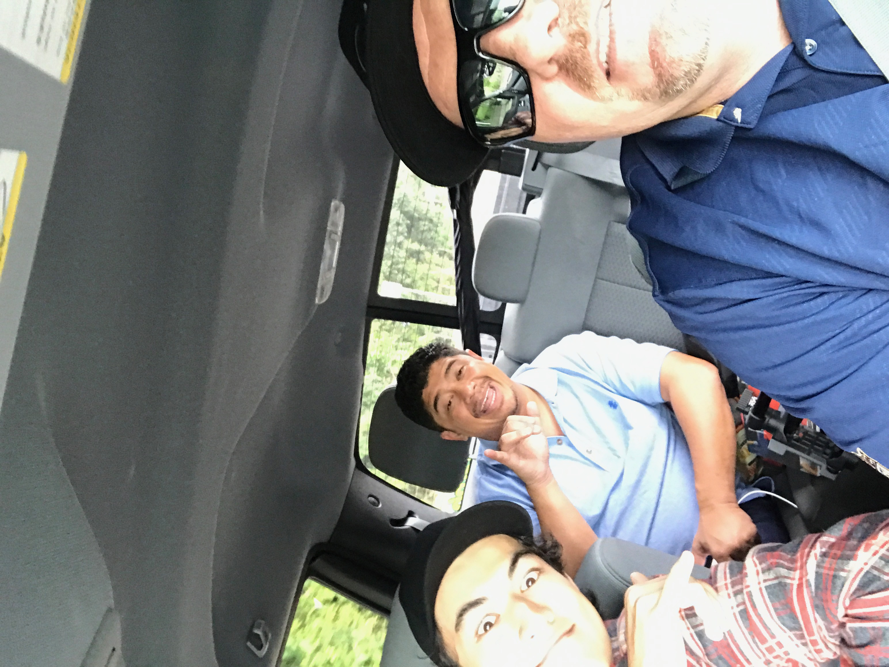

I was brought into a filming program in my 7th grade of middle school which my Dad started with the school's principal to get students involved in football. My skills grew as I filmed football every weekend and I eventually went with my Dad to film gigs and reports for the news. This experience I had while I filmed was fun for me because on top of learning the tricks behind the camera, I got access to cool areas due to my skills and knowledge.

I was responsible for the main shots for most of the gigs I went to, from being on a concert stage to panning up models as they walk down the runway to highlight the designer's clothes. A lot of pressure was put on me then but to be honest it was like a rush and it was always fun to me.

 
Some live shots
[Hawaii News Now](https://www.hawaiinewsnow.com/story/36282538/hundreds-hit-the-ground-running-for-9th-annual-kauai-marathon/)
,
[Star Advertiser](https://www.staradvertiser.com/2014/08/09/breaking-news/firefighters-find-body-of-missing-hiker-swept-down-kauai-stream/)
