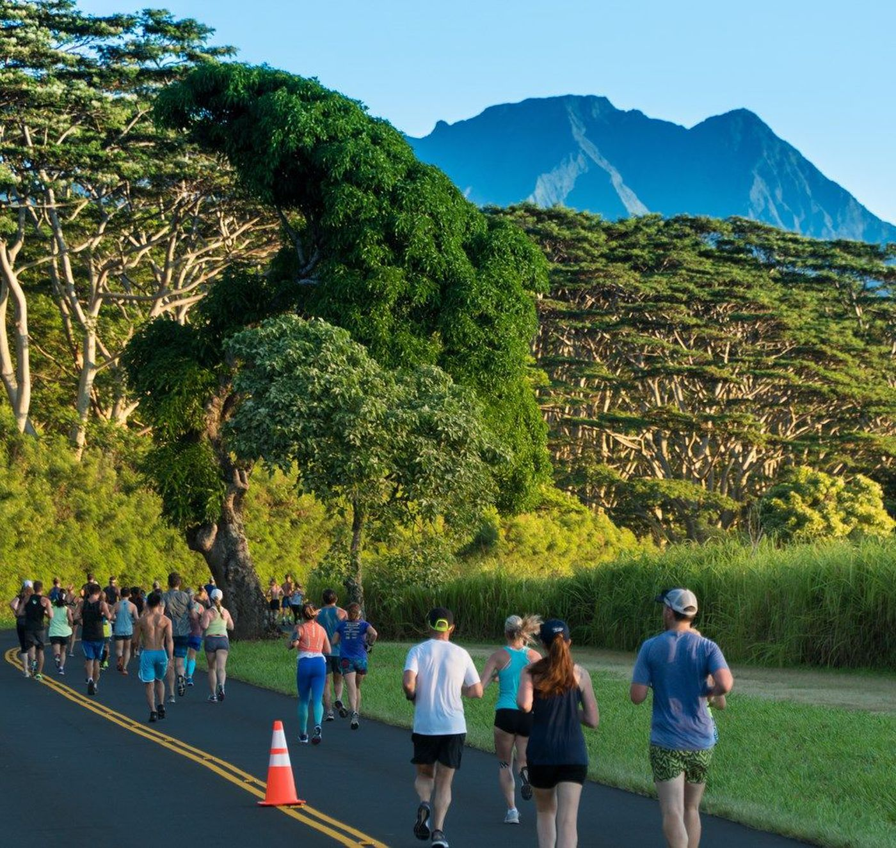

I was brought into a filming program my 7th grade of middle school which my Dad started with the school's principle to get sudents involed in football. My skills grew as I filmed football every weekend and I eventually went with my Dad to film gigs and reports for the news. 

 
Some live shots
[Hawaii News Now](https://www.hawaiinewsnow.com/story/36282538/hundreds-hit-the-ground-running-for-9th-annual-kauai-marathon/),
[Star Advertiser](https://www.staradvertiser.com/2014/08/09/breaking-news/firefighters-find-body-of-missing-hiker-swept-down-kauai-stream/)
